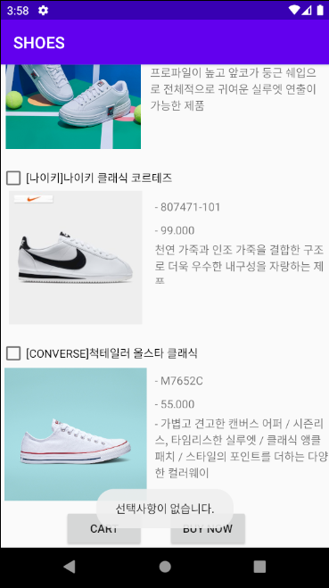
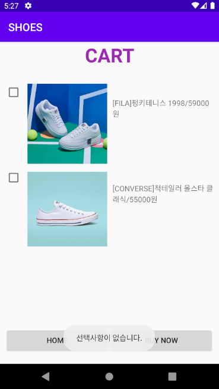
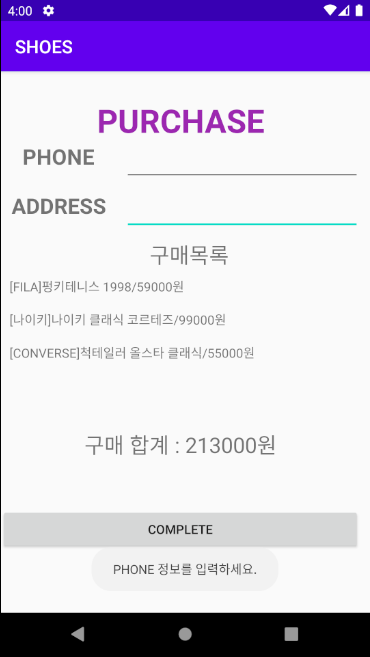
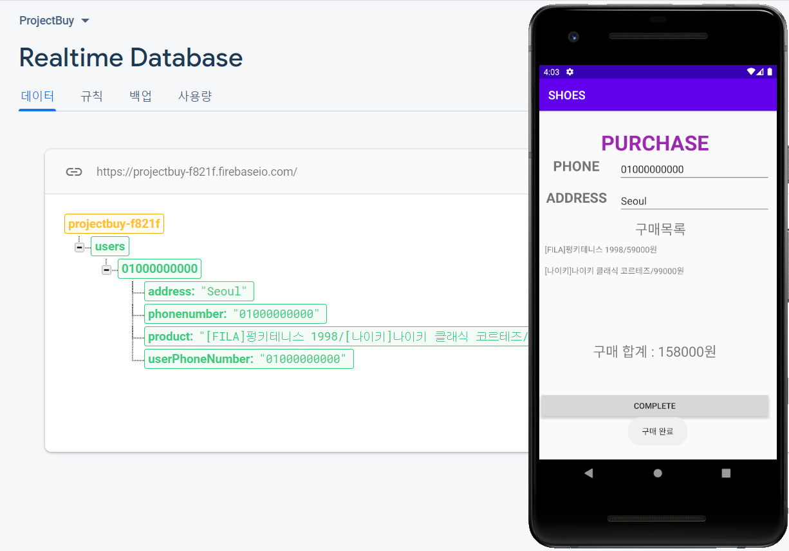
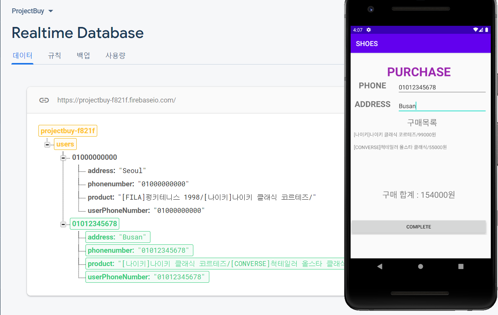

# [모바일 프로그래밍] Project_Buy
### 소프트웨어학부 20191686 최혜원
### https://github.com/Hyewon0223/2020-2_MobileProgramming
---
### 실행 환경
- Android Studio 4.0
- AVD : Pixel 2 API 30
---
### 파일 설명
#### > 정보
- Project_info : 개인 과제 구현 내용 및 점수 등의 과제 설명
- Product_info : Project_Buy의 상품 설명
#### > JAVA
- MainActivity : 선택된 상품 정보 및 가격을 장바구니 또는 구매 화면에 전달
- CartActivity : 선택 화면의 정보 받기 / 장바구니에서 선택된 상품 구매 화면으로 전달
- BuyActivity : 선택 화면 또는 장바구니로부터 상품 정보 받기 / firebase로 정보 전달
- User : firebase에 담을 정보 정리  
  
#### > Layout
- activity_main.xml 
  + Relative Layout으로 구성
  + 상품 이름, 가격 및 정보 표시
  + 장바구니 또는 바로 구매 버튼 선택 가능   
- activity_cart.xml 
  + Linear Layout으로 구성
  + 상품 선택 화면에서 check된 상품 표시
  + HOME(상품 선택 화면) 또는 구매 버튼 선택 가능   
- activity_buy.xml 
  + Table Layout으로 구성
  + 상품 선택 화면 또는 장바구니에서 check된 상품 구매 
  + 전화번호, 주소 입력 
  + 구매 완료시 Select 화면으로 이동
---
### 실행 화면
#### > 기본 화면
1. 상품 선택 화면
- 기본 화면   
</img>
</img>   
   
- 어떤 것도 체크 되어 있지 않을 경우   
</img>   
   
2. 장바구니 화면
- 기본 화면   
</img>
   
- 어떤 것도 체크 되어 있지 않을 경우   
</img>   
   
3. 구매 화면
- 기본 화면   
</img>   
   
- PHONE 또는 ADDRESS 정보를 입력하지 않을 때   
</img>   
   
- firebase 정보전달   
</img>
</img>
---
### 주요 코드 및 구현 내용 설명
#### > 상품 선택 화면
1) 다른 화면으로 보낼 정보 String으로 저장해 배열로 리턴
```
public String[] TrimData(){
  int check = 0; 
  String product = "";
  for (int i=0;i<checkboxProduct.length;i++) { 
    if (checkboxProduct[i].isChecked()) { // 상품에 check되면
      check++; 
      product += productName[i] + "/" + productPrice[i] + "&"; // 상품명과 가격 사이에는 '/'로 구분, 상품과 상품 사이는 '&'로 구분
    }
  }
  if (check==0) return null; // 받아온 정보가 없다면 정보를 보내지 않음
  String[] checkProduct = product.split("&"); // product를 &를 기준으로 분리해 checkProduct 배열에 저장
  return checkProduct; // checkProduct 배열 리턴
}
```

2) TrimData()메소드를 이용해 다른 페이지로 정보 전달
```
String[] DATA = TrimData();
if (DATA == null) Toast.makeText(getApplicationContext(), "선택사항이 없습니다.", Toast.LENGTH_LONG).show(); //데이터가 없다면 보내지 않음
else { // 그렇지 않으면 DATA 전달
  Toast.makeText(getApplicationContext(), "장바구니 페이지", Toast.LENGTH_LONG).show(); // 페이지를 이동할 때 Toast메시지를 이용해 "장바구니 페이지"라는 메시지 표시
  Intent infointent = new Intent(MainActivity.this, CartActivity.class); // intent 객체를 생성
  infointent.putExtra("data", DATA); // intent에 부가 데이터 넣기
  startActivity(infointent); // 액티비티 띄우기
  finish();
}
```

#### > 장바구니 화면
1) 상품 선택 화면으로부터 정보를 받아와 화면에 이미지와 상품명, 가격 출력
```
Intent dataintent = getIntent(); // intent 객체가 반환
String[] data = dataintent.getStringArrayExtra("data");

for (int i=0;i<data.length;i++) {
    // Ex ) data = {product1/price1, product2/price2}
    String[] select = data[i].split("/"); // data[i]의 상품과 가격을 분리해 select 배열에 저장
    // productName 배열에서의 이름이 같다면, ImageView에 해당 사진 표시
    if (select[0].equals(productName[0])) img[i].setImageResource(R.drawable.fila);
    else if (select[0].equals(productName[1])) img[i].setImageResource(R.drawable.nike);
    else if (select[0].equals(productName[2])) img[i].setImageResource(R.drawable.converse);
    check[i].setVisibility(View.VISIBLE); // 데이터의 수만큼 숨겨놓은 CheckBox를 화면에 표시
    check[i].setChecked(true); // 화면에 나타난 CheckBox에 check를 남김
    txt_name[i].setText(select[0]+"/"+select[1]+"원"); // textView에 상품과 가격을 표시
}
```

2) 구매 화면으로 정보 전달 - 장바구니 화면의 텍스트를 저장
```
String product = ""; // 다른 화면에 보낼 데이터를 저장할 String
for (int i = 0; i < check.length; i++) {
    if (check[i].isChecked()) { // check가 되어있다면
        String text = txt_name[i].getText().toString(); // 해당 textView의 텍스드를 text에 저장
        product += text + "&"; // product에 text와 상품 구분을 위한 &기호 더해줌
    }
}
String[] checkProduct = product.split("&"); // product에서 &기호를 기준으로 checkProduct에 분리함
// product가 빈 스트링 이라면 선택 사항이 없다는 Toast메시지 출력
if (product.equals("")) Toast.makeText(getApplicationContext(), "선택사항이 없습니다.", Toast.LENGTH_LONG).show();
else {
    Toast.makeText(getApplicationContext(), "구매 페이지", Toast.LENGTH_LONG).show(); // 구매 페이지로 넘어갈 때 "구매 페이지"라는 Toast 메시지 출력

    Intent infointent = new Intent(CartActivity.this, BuyActivity.class); // intent 객체 생성
    infointent.putExtra("data", checkProduct); // intent에 부가 데이터터
   startActivity(infointent); // 액티비티 띄우기
}
```

#### > 정보 입력 및 구매 화면
1) 상품의 합계를 계산하고 화면에 표시
```
Intent dataintent = getIntent(); // intent객체 반환
String[] data = dataintent.getStringArrayExtra("data");
int sum = 0;

for (int i=0;i<data.length;i++) {
    // Ex ) data = {product1/price1, product2/price2}
    String[] select = data[i].split("/"); // select 배열에 data[i]를 /기준으로 분리해 넣음
    String[] price = select[1].split("원"); // price 배열에 select[1] (=price)를 "원"을 기준으로 분리해 넣음
    txt[i].setText(select[0]+"/"+price[0]+"원"); // textView에 상품명과 가격을 화면에 표시함
    sum += Integer.parseInt(price[0]); // "원"을 분리한 가격(오로지 숫자)만을 숫자로 변환해 sum에 더해줌
}
txt_sum.setText("구매 합계 : "+sum+"원"); // 상품 가격의 총 합을 textView에 표시
```

2) PHONE과 ADDRESS 정보를 입력하지 않을 시 Toast메시지를 이용해 화면에 표시
```
String editTextPhone = editPhone.getText().toString(); // 사용자가 입력한 PHONE 정보를 스트링으로 변환 후 저장
String editTextAddress = editAddress.getText().toString(); // 사용자가 입력한 ADDRESS 정보를 스트링으로 변환 후 저장
String userId = editTextPhone; // userId를 사용자의 핸드폰 번호로 지정

if (editTextPhone.length() == 0){ // 사용자가 PHONE의 정보를 입력하지 않았을 때
    Toast.makeText(getApplicationContext(),"PHONE 정보를 입력하세요.", Toast.LENGTH_LONG).show(); // Toast메시지 출력
}
else if (editTextAddress.length() == 0){ // 사용자가 ADDRESS 정보를 입력하지 않았을 때
    Toast.makeText(getApplicationContext(),"ADDRESS 정보를 입력하세요.", Toast.LENGTH_LONG).show(); // Toast메시지 출력
}
```

3) PHONE과 ADDRESS에 정보를 입력하면 구매 완료
```
else {
    Toast.makeText(getApplicationContext(),"구매 완료", Toast.LENGTH_LONG).show(); // Toast 메시지로 "구매 완료"를 화면에 표시
    Intent myintent = new Intent(BuyActivity.this, MainActivity.class); // intent 생성
    HashMap result = new HashMap<>(); // HashMap 생성
    // HashMap에 다음과 같은 값을 저장
    result.put("phone", editTextPhone);
    result.put("address", editTextAddress);
    result.put("product", data_product);

    writeNewUser(userId, editTextPhone, editTextAddress, data_product); // writeNewUser 호출

    startActivity(myintent); // Activity 띄우기
    finish();
}
```

4) firebase 
```
private void writeNewUser(String userId, String phonenumber, String address, String product) {
    User user = new User(phonenumber, address, product); // User 생성

    mDatabase.child("users").child(userId).setValue(user)
            .addOnSuccessListener(new OnSuccessListener<Void>() {
                @Override
                public void onSuccess(Void aVoid) {
                    // Write was successful!
                    Toast.makeText(BuyActivity.this, "저장을 완료했습니다.", Toast.LENGTH_SHORT).show();
                }
            })
            .addOnFailureListener(new OnFailureListener() {
                @Override
                public void onFailure(@NonNull Exception e) {
                    // Write failed
                    Toast.makeText(BuyActivity.this, "저장을 실패했습니다.", Toast.LENGTH_SHORT).show();
                }
            });
}

private void readUser(){
    String userId = editPhone.getText().toString();
    mDatabase.child("users").child(userId).addValueEventListener(new ValueEventListener() {
        @Override
        public void onDataChange(@NonNull DataSnapshot dataSnapshot) {
            // Get Post object and use the values to update the UI
            if(dataSnapshot.getValue(User.class) != null){
                User post = dataSnapshot.getValue(User.class);
                Log.w("FireBaseData", "getData" + post.toString());
            } else {
                Toast.makeText(BuyActivity.this, "데이터 없음...", Toast.LENGTH_SHORT).show();
            }
        }

        @Override
        public void onCancelled(@NonNull DatabaseError databaseError) {
            // Getting Post failed, log a message
            Log.w("FireBaseData", "loadPost:onCancelled", databaseError.toException());
        }
    });
}
```
